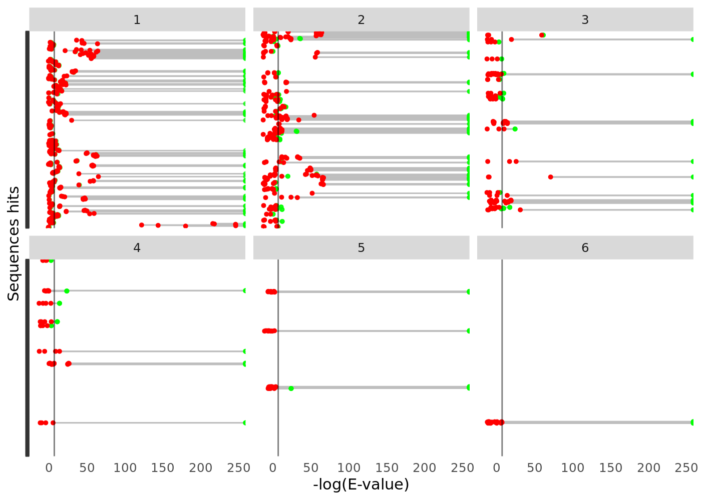
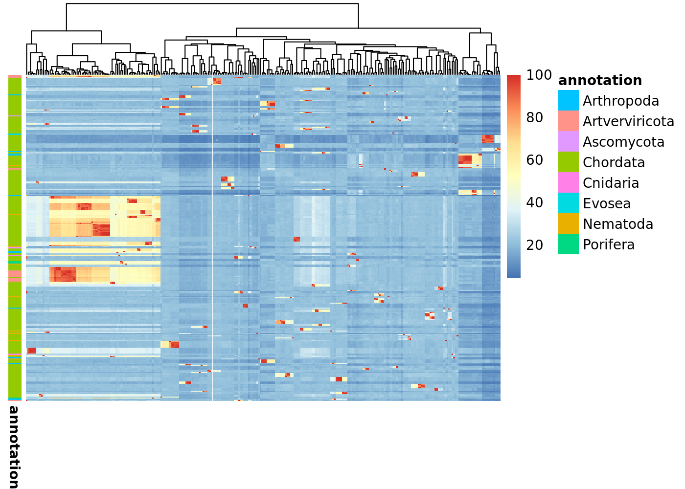

<!-- README.md is generated from README.Rmd. Please edit that file -->

# HMMERutils

<!-- badges: start -->

[](https://github.com/currocam/HMMERutils/issues)
[](https://github.com/currocam/HMMERutils/pulls)
[](https://lifecycle.r-lib.org/articles/stages.html#experimental)
[](https://bioconductor.org/checkResults/release/bioc-LATEST/HMMERutils)
[](https://github.com/currocam/HMMERutils/actions/workflows/check-bioc.yml)
[](https://app.codecov.io/gh/currocam/HMMERutils?branch=master)

<!-- badges: end -->

The goal of `HMMERutils` is to provide a bunch of convenient functions
to search for homologous sequences using the HMMER API, annotate them
taxonomically, calculate physicochemical properties and facilitate
exploratory analysis of homologous sequence data.

## Installation instructions

We are still working on submitting this project to Bioconductor. Then,
right now you can only install the development version from
[GitHub](https://github.com/currocam/HMMERutils) with:

``` r
BiocManager::install("currocam/HMMERutils")
```

## Example

This is a basic example that shows you how to solve a common problem:

``` r
library("HMMERutils")
fasta_2abl <- paste0(
    "MGPSENDPNLFVALYDFVASGDNTLSITKGEKLRVLGYNHNGEWCEAQTKNGQGW",
    "VPSNYITPVNSLEKHSWYHGPVSRNAAEYLLSSGINGSFLVRESESSPGQRSISL",
    "RYEGRVYHYRINTASDGKLYVSSESRFNTLAELVHHHSTVADGLITTLHYPAP"
)
data <- search_phmmer(seq = fasta_2abl, seqdb = "swissprot") %>%
    add_sequences_to_hmmer_tbl() %>%
    add_taxa_to_hmmer_tbl() %>%
    add_physicochemical_properties_to_HMMER_tbl()
```

Now, you can easily summarize the information using the well-known
function from [Tidyverse](https://www.tidyverse.org/), integrating
taxonomic information as well as theoretical protein index.

``` r
library(dplyr)
#> 
#> Attaching package: 'dplyr'
#> The following objects are masked from 'package:stats':
#> 
#>     filter, lag
#> The following objects are masked from 'package:base':
#> 
#>     intersect, setdiff, setequal, union
data %>%
    filter(hits.evalue > 10^-5) %>%
    distinct(hits.fullfasta, .keep_all = TRUE) %>%
    group_by(taxa.phylum) %>%
    summarise(
        n = n(),
        "Molecular.Weight" = mean(properties.molecular.weight, na.rm = TRUE)
    )
#> # A tibble: 7 × 3
#>   taxa.phylum        n Molecular.Weight
#>   <chr>          <int>            <dbl>
#> 1 Arthropoda         2          197779.
#> 2 Artverviricota     3           71266.
#> 3 Ascomycota        19          126362.
#> 4 Basidiomycota      1          139552.
#> 5 Chordata          71           77001.
#> 6 Evosea             3          102576.
#> 7 Nematoda           6           55944.
```

You can take advantage of this library and
[ggplot2](https://ggplot2.tidyverse.org/)to visualize how your expected
values (per sequence and domain) are distributed and how it is related
to the architecture of the protein.

``` r
library(ggplot2)
hmmer_evalues_cleveland_dot_plot(data) +
    ggplot2::facet_wrap(~hits.ndom)
```



And use some handy functions to even cluster your sequences based on
their pairwise identity and visualize it as a heat map. In the following
chunk of code we are:

1.  Filtering the sequences based on the E-value of the best scoring
    domain, instead of the E-value of the whole sequence.
2.  Calculating the pairwise sequence identity.
3.  Visualize the resulting matrix as a heat map, annotating it using
    taxonomic information.

``` r
filtered <- filter_hmmer(data, by = "domains.ievalue")
pairwise_identities <- pairwise_alignment_sequence_identity(filtered$hits.fullfasta)
#> Warning in check_seqs(seqs): 'seqs' has no names or some names are NA
pairwise_sequence_identity_heatmap(pairwise_identities, filtered$hits.ph)
```



## Citation

Below is the citation output from using `citation('HMMERutils')` in R.
Please run this yourself to check for any updates on how to cite
**HMMERutils**.

``` r
print(citation("HMMERutils"), bibtex = TRUE)
```

Please note that the `HMMERutils` package was only made possible thanks
to many other R and bioinformatics software authors, which are cited
either in the vignettes and/or the paper(s) describing this package.

## Code of Conduct

Please note that the `HMMERutils` project is released with a
[Contributor Code of
Conduct](http://bioconductor.org/about/code-of-conduct/). By
contributing to this project, you agree to abide by its terms.

## Development tools

- Continuous code testing is possible thanks to [GitHub
  actions](https://www.tidyverse.org/blog/2020/04/usethis-1-6-0/)
  through *[usethis](https://CRAN.R-project.org/package=usethis)*,
  *[remotes](https://CRAN.R-project.org/package=remotes)*, and
  *[rcmdcheck](https://CRAN.R-project.org/package=rcmdcheck)* customized
  to use [Bioconductor’s docker
  containers](https://www.bioconductor.org/help/docker/) and
  *[BiocCheck](https://bioconductor.org/packages/3.16/BiocCheck)*.
- Code coverage assessment is possible thanks to
  [codecov](https://codecov.io/gh) and
  *[covr](https://CRAN.R-project.org/package=covr)*.
- The [documentation website](http://currocam.github.io/HMMERutils) is
  automatically updated thanks to
  *[pkgdown](https://CRAN.R-project.org/package=pkgdown)*.
- The code is styled automatically thanks to
  *[styler](https://CRAN.R-project.org/package=styler)*.
- The documentation is formatted thanks to
  *[devtools](https://CRAN.R-project.org/package=devtools)* and
  *[roxygen2](https://CRAN.R-project.org/package=roxygen2)*.
